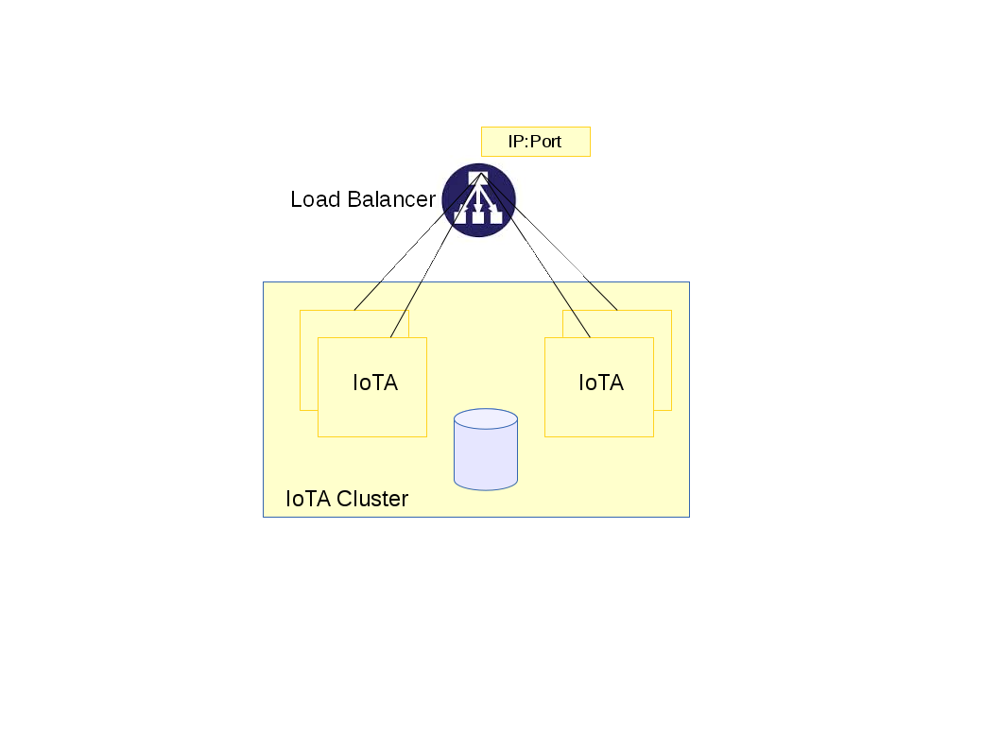

# Architecture
* [Components](#Components)
* [Data flow](#Dataflow)
* [High availability](#HighAvailability)

These IoT Agents are based on Pion Network Library (http://pion.sourceforge.ne/).

## Definitions
###### Service
A service is a concept like tenant. It is the most high level in hierarchy of resources. Every request has a Fiware-Service header indicating the service.
###### Subservice
A service could have subservices (next level). Every request has a Fiware-ServicePath indicatin the subservice. If a request affects to level service, Fiware--ServicePath is considered "/".

## Components

 

- IoTAgent-Core: it could be seen like an C++ platform to build IoT Agents. It provides a HTTP server with common functionalities (provision and configuration, PEP, utilities to publish and future common features). In this server, you can configure URLs. Each url is associated with a protocol and its functionality is implemented as a module or plugin. You can see [Features](#../README.md) in order to learn what this component provides.
- Plugins or Modules:  Functionally, a module is an IoT Agent because it understands a protocol and it builds Orion Context Broker's entity with protocol information.
- MongoDB: provisioned information is stored in Mongo database. In [Deploy](deploy.md) section you can see how MongoDB is configured. Collections used by IoTAgent are:

  + SERVICE: stores service configuration. 
      - _id: It is an unique identifier assigned by MongoDB.
      - service: Name of service (related with Fiware-Service).
      - service_path: Name of subservice (related with Fiware-ServicePath).
      - apikey: It is a key used by devices in order to publish. It could be empty.
      - resource: It is path into HTTP server used as iotagent container.
      - cbroker: (optional) A service could have a specific Context Broker. This field stores Context Broker URL.
      - entity_type: (optional) Default entity type.
      - token: (optional) If IoTA works in oauth environment, this field stores a trust token to identify IoTA as authorized application.
      - outgoing_route: (optional) GRE tunnel identifier.
      - attributes: (optional) It stores a common mapping of protocol parameters. It is an array with following fields:
          - object_id: Name of parameter to map.
          - type: Type for entity attribute type.
          - name: Name of attribute. (object_id will be mapped to this name).
      - static_attributes: It is an array of attributes provided by an operator. A static attribute is not related with information from device.
          - name: Name of attribute.
          - type: Type for entity attribute.
          - value: Attribute value.
  This collection is indexed by service, service_path and resource.
      
  + DEVICE: stores device configuration. 
      - _id: It is an unique identifier assigned by MongoDB.
      - device_id: Name/identifier of device.
      - entity_name: Name of entity used to plublish information.
      - entity_type: Type of entity used to publish information.
      - endpoint: (optional) URL to send commands (push commands).
      - timezone: (optional, nor used). 
      - service: Name of service (related with Fiware-Service).
      - service_path: Name of subservice (related with Fiware-ServicePath).
      - protocol: Protocol used by device.
      - attributes: (optional) It stores a common mapping of protocol parameters. It is an array with following fields:
          - object_id: Name of parameter to map.
          - type: Type for entity attribute type.
          - name: Name of attribute. (object_id will be mapped to this name).
      - static_attributes: It is an array of attributes provided by an operator. A static attribute is not related with information from device.
          - name: Name of attribute.
          - type: Type for entity attribute.
          - value: Attribute value.
      - commands: (optional) It stores attributes used as commands. It is an array with following fields:
          - value: Raw command to send.
          - type: "command".
          - name: Name of attribute. (object_id will be mapped to this name).
  This collection is indexed by device_id, service and service_path.
  
  + COMMAND: stores status of commands. 
      - _id: It is an unique identifier assigned by MongoDB.
      - name: command (name of attribute).
      - node: Name/identifier of device.
      - entity_name: Name of entity used to plublish information.
      - entity_type: Type of entity used to publish information.
      - uri: (optional) Where command was sent (push commands).
      - service: Name of service (related with Fiware-Service).
      - service_path: Name of subservice (related with Fiware-ServicePath).
      - expired: deprecated an not used.
      - timeout: Waiting time for response.
      - id: command identifier.
      - sequence: (not used).
      - status: Status of command (0-Ready for read, 1-Expired read, 2-Delivered, 3-Expired delivery, 4-Executed, 5-Not delivered.
          
  This collection is indexed by id, service and service_path.
  
When IoTA works as manager (is started with -m option), it does not use plugins/modules for protocol implementations and MongoDB collections are:
   
   + PROTOCOL: It stores information of protocols.
      - _id: It is an unique identifier.
      - protocol: Identifier/name of protocol.
      - description: Description of protocol.
      - endpoints: It is an array
         - endpoint: IoTA with protocol.
         - resource: Path in IoTA for this protocol.
    This collection is indexed by protocol.
   + SERVICE_MGMT: It stores information of services. (Others fields as SERVICE collection).
      - _id: It is an unique identifier.
      - protocol: Identifier/name of protocol.
      - description: Description of protocol.
      - iotagent: IoTA with this service and protocol. 
   This collection is indexed by service, service_path, iotagent and protocol.

IoT Agent based on PION loads modules as HTTP plugins associated with an URL. This URL (_resource_ field in configuration) identifies a point of entry into HTTP server and could be the point of entry for devices using HTTP protocol.

When devices use a protocol no HTTP, a module associated with an URL into HTTP server implements that protocol and defines its own points of entry for device communications. Module establishes the relationship:
```Device Point of Entry``` <-> ```PION Module``` <-> ```URL into HTTP server```.


## Data Flow
Flows may be classified in provision, publication and commands.
### Provision Flow
1. An user can request add a service or device. In request, Fiware-Service and Fiware-ServicePath identify the request target. If PEP is not configured, the next action is (6).
2. If PEP is configured, the header X-Auth-Token is validated against Identity Manager.
3. Identity Manager returns a role for user. (If user token is not valid or user has not a role for subservice then request is unauthenticated)
4. If PEP is configured and user has a role, agent request to Access Control authorization for that request.
5. Access Control authorizes or unauthorizes the request.
6. Data (service or device) is stored in database.

### Publication Flow
This flow has a _m_ subscript in image.

1. A device send data. For that, it uses the url identifying its protocol.
2. Agent checks if device has provisioned information. This information takes precedence over default information.
3. As user _iotagent_, agent request a valid token to Identity Manager (it uses the token configured by service/subservice in order to send this request).
4. Identity Manager returns a token. This token will be used if Orion Context Broker uses a PEP.
5. Agent sends _updateContext_ (publish) to Orion Context Broker.

### Command Flow
This flow has a _c_ subscript and flows to get a _iotagent_ token is repeated.  Additional information in [Commands](commands.md).

1. Only provisioned devices with commands are considered. A command is published like an entity attribute and IoT Agent is its provider.
2. IoT Agent send _registerContext_.
3. A command is _updateContext_ operation. This operation has entity and attribute (command to execute).
4. Command is stored in database (a command could be an asynchronous operation).
5. Agent sends command to device.


## High Availability 
If high availability is required, architecture should be redundant and several iotagents  will be running.  Then should exits a load balancer to manage communications between several iotagent and contextBroker  processes.




Load balancer url must be defined in a field "public_ip" as you can check in configuration section (public_ip is ip address and port). This url will be used to build "providingApplication" which will be sent in context registrations to contextBroker.
An IoTA cluster is composed of IoT Agent with the same chareacteristics. That is, every IoTA into cluster provides the same protocol/s and shares database and collections. Every IoTA into cluster has the same "public_ip".
If a different protocol must be deploy and this new protocol is deployed in other IoT Agent, a new cluster must be configured. That is, a different "public_ip" must be configured (in IoTA configuration and load balancer). This new IoTA uses a different database.


