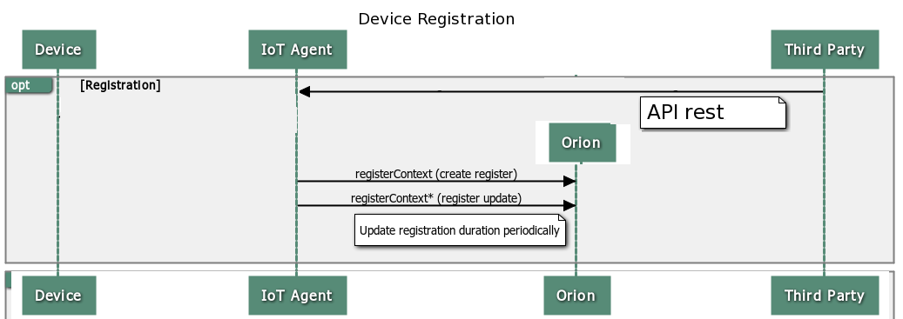
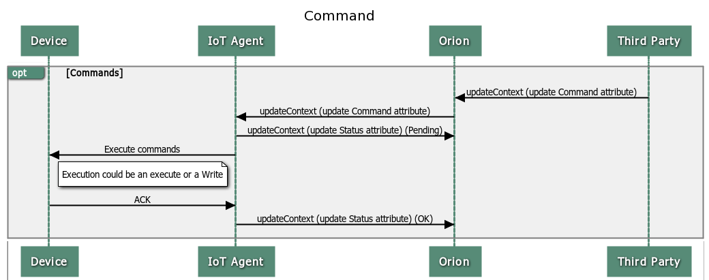
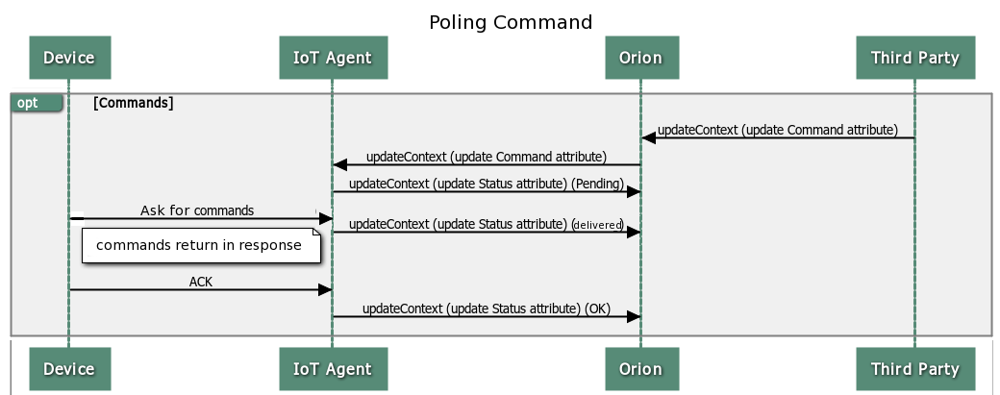

FORMAT: 1A

# Resource IotAgent Commands

NOTE: This document is a **work in progress**.


#### Index
1. [Introduction](#def-introduction)
2. [Provisioning comands](#def-prerequisites)
3. [Send an command](#def-sendCommand)
4. [Check results](#def-result)
5. [polling](#def-polling)
6. [Calls to Context Broker](#def-API_cb)

<a name="def-introduction"></a>
## 1. Introduction

This chapter describes how to configure and send commands to devices.
A command is an operation or action that a device can do.
This command is composed of a name (identifier) and a value (all data send to the device).

Provisioning a device is mandatory to send a command. You can do this with with Iotagent API
[Iotagent API](API_REFERENCE.md) or [Iotagent config file](deploy.md#def-resources)


A command has different parts:


- Provisioned command (data to create the command text that the device is able to understand )

| Parameter     |description               |
| ------------- |:-------------:           |
| name   | identifier command for users     |
| type  | command      |
| value | View note below   |

- specific command data (when you send a single command, you can send specified data in the value of attribute)

This data can be the entire text send to device, or parameters used as a part of this.

**Note: From version 1.3.0, a common format for value attribute has been defined. This format consists of a JSON object with every field is a command parameter. This parameter will be processed by every protocol instance building command to send. This format is recommended and other defined formats are deprecated.**
```
{
  "parameter_1": value_1,
  "parameter_2": "value_2"
}
```
 

 [More information](#def-sendCommand)



Provisioning a device is mandatory to send a command. 
A user can provision a device with commands. IotAgent registers the device and the commands in Contest Broker, so you can send and
[Updatecontext](https://forge.fiware.org/plugins/mediawiki/wiki/fiware/index.php/Publish/Subscribe_Broker_-_Orion_Context_Broker_-_User_and_Programmers_Guide#Update_context_elements) (how to send a command)





Example: execute the command PING with data 22.
```
curl -X POST http://$CB:$PORT/iot/ngsi/updateContext \
     -i \
-H "Content-Type: application/json" \
-H "Fiware-Service: TestServiceF" \
-H "Fiware-ServicePath: /TestSubserviceF" \
-d ' {"updateAction":"UPDATE","contextElements":[{"id":"entity_name","type":"entity_type","isPattern":"false","attributes":[{"name":"PING","type":"command","value":"{\"data\": \"22\"}" } ]} ]}'
```

Context broker sends the updateContext to Iotagent, Iotagent check provisoned device and  send to the device "device_id@ping6|data=22", in the same http, the device returns the result.


There are two type of commands

- Push command, the command is sent to device, and the the device responds immediately. 

- Poling commands, these actions can spend too much time or the device is sleeping, so Iotagent doesn't send the commands to iotagent, waits for the device to ask for.
User can check the status of the command because of IotAgent update an special attribute (command name + "_status") so
user can subscribe or consult this.



[more information about polling commands](#def-polling)

<a name="def-prerequisites"></a>
## 2. Provisioning commands

Example, provisioning a command named PING, this command is ul20
```
curl -X POST http://$HOST:$PORT/iot/devices \
-i \
-H "Content-Type: application/json" \
-H "Fiware-Service: TestService" \
-H "Fiware-ServicePath: /TestSubservice" \
-d ' { "devices": [ { "device_id": "device_id", "entity_name": "entity_name", "entity_type": "entity_type", "timezone": "America/Santiago", "commands": [{ "name": "PING", "type": "command", "value": ""}]  } ] }'
```

Data for the command

{
 
"name": "PING",

"type": "command",
 
"value": ""

}
You can see that the information is only the command name (in the example "PING") and the type is command, value is empty, iotagent fills neccesary data. 

When you provisioning a command, iotagent register this command and device in context Broker, so you can check it with the context Broker [Discover Context Availability API](https://forge.fiware.org/plugins/mediawiki/wiki/fiware/index.php/Publish/Subscribe_Broker_-_Orion_Context_Broker_-_User_and_Programmers_Guide#Convenience_Discover_Context_Availability)

<a name="def-sendCommand"></a>
## 3. Send a Command

You must send an updateCommand via http to the Context Broker, where the iot agent has registered the command
[Update context elements](https://forge.fiware.org/plugins/mediawiki/wiki/fiware/index.php/Publish/Subscribe_Broker_-_Orion_Context_Broker_-_User_and_Programmers_Guide#Update_context_elements)

You must use te entity name of the device, and the command name. An example with the before command.

updateCommand send to Context Broker

```
curl -X POST http://$HOST:$PORT/v1/updateContext \
     -i \
-H "Content-Type: application/json" \
-H "Fiware-Service: TestService" \
-H "Fiware-ServicePath: /TestSubservice" \
-d ' {"updateAction":"UPDATE","contextElements":[{"id":"entity_name","type":"entity_type","isPattern":"false","attributes":[{"name":"PING","type":"command","value":"{\"data\": \"22"}" } ]} ]}'
``` 

Context Broker redirect this updateContext command to iotagent. If you have permissions for this operation, Iotagent transforms this command to 

```
device_id@PING|data=22
```
This example is ul20, the iotagent fills "device_id@PING" with the protocol information (device_name@comand_name)  and appends the parameter value fills in the updateContext command (in the example 22).

This text is sent to device.

The device can respond this command, this is an example using ul20 protocol.

```
device_id@PING|Ping OK
``` 

If you remembered, the provisioned data for device was

```
{ "name": "PING", "type": "command", "value": ""}
```

###You can use several parameters.

the provision of device is the same

```
{"name": "SET","type": "command","value": ""}
```
updateContext with value as JSON object
```
{"name": "SET","type": "command", "value": "{\"DATE\":\"2015-07-15\", \"TIME\": \"06:48:15\"}"}
```
data sent to device (this transformation is an example)
```
device_id@SET|DATE=2015-07-15|TIME=06:48:15
```


###Information about status and result commands

Iotagent read the response command, and save this in a specific attribute of the device.
Every command has two special attributes

<command_name>_status:  status of the command

<command_name>_info:  final result of the command or error.

In this example, this attributes are.

PING_status:  OK
PING_info:   device_id@PING|Ping OK

In PUSH command like this example it can be two status 

| status     |description               |
| ------------- |:-------------:           |
| OK   | command completed, see <command name>_info attribute to see the result    |
| not delivered   | name of the service_path (must start with /)    |

<command_name>_info
command result

Error message:

{ "errorCode" : { "code":404, "reasonPhrase":"The service does not exist"}}

{ "errorCode" : { "code":404, "reasonPhrase":"The device does not exist"}}

{ "errorCode" : { "code":404, "reasonPhrase":"the device does not have implemented this command"}}

{ "errorCode" : { "code":400, "reasonPhrase":"this is not a valid command"}}

{ "errorCode" : { "code":404, "reasonPhrase":"the device does not have implemented this command"}}


<a name="def-result"></a>
## 4. Check results

The user sends command to Context Broker, and checks the result to Context Broke, with  [Query Context operation](https://forge.fiware.org/plugins/mediawiki/wiki/fiware/index.php/Publish/Subscribe_Broker_-_Orion_Context_Broker_-_User_and_Programmers_Guide#Query_Context_operation)

You need to know the service, servicePath, entity name for the device, the name of the command and query context for the attribute  <command_name>_info  (information sent by device) or <command_name>_status (information about the status of the process)

<a name="def-polling"></a>
## 5. Polling

### Special attributes

Special attributes to check command resolution

"command_name"_status :

| status     |description               |
| ------------- |:-------------:           |
| pending     | command ready, but the device still has not asked for|
| expired read   | command expired, the device didn't ask for it.    |
| delivered   | the device has received the command, but did not send the result    |
| delivered but no respond   | command delivered, but no command result from device     |
| OK   | command completed, see <command name>_info attribute to see the result  |

"command_name"_info : 
comman result

### Polling commands scenario

To manage polling commands you shuold create a device witout endpoint. Below two are provided, the first to create a service and the second one to create a device without commands endpoint. In this example command attributa name is "ping"

```
curl -X POST http://x.x.x.x:8080/iot/services \
-i \
-H "Content-Type: application/json" \
-H "Fiware-Service: TestService" \
-H "Fiware-ServicePath: /ssrvTest" \
-d '{"services": [{ "apikey": "apikey3", "token": "token2", "cbroker": "http://y.y.y.y:1026", "entity_type": "thing", "resource": "/iot/d" }]}'


curl -X POST http://x.x.x.x:8080/iot/devices \
-i \
-H "Content-Type: application/json" \
-H "Fiware-Service: TestService" \
-H "Fiware-ServicePath: /ssrvTest" \
-d ' { "devices": [ { "device_id": "device_id_2", "entity_name": "entity_name_2", "entity_type": "entity_type", "timezone": "America/Santiago", "commands": [ { "name": "ping", "type": "command", "value": ""} ], "attributes": [ { "object_id": "source_data", "name": "attr_name", "type": "int" } ], "static_attributes": [ { "name": "att_name", "type": "string", "value": "value" } ] } ] }'
```


To generate a polling command, contextBroker should send a updateContextRequest to URL in which iotagent is listening for NGSI messages by this resource, in this case "http://x.x.x.x:8080/iot/ngsi/d/updateContext" with  "Fiware-Service" and "Fiware-ServicePath" header. This updateContest from contextBroker could be simulates with the curl: 

```
curl --request POST  http://x.x.x.x:8080/iot/ngsi/d/updateContext --header 'Fiware-Service: TestService' --header 'Fiware-ServicePath: /ssrvTest'  --header 'Content-Type: application/json' $CURL_VERBOSE --data-binary @ngsi_update_cmd_p.json
```

In ngsi_update_cmd_p.json

```
{"updateAction":"UPDATE","contextElements":[{"id":"entity_name_2","type":"entity_type","isPattern":"false","attributes":[{"name":"ping","type":"command","value":"OK"}]}]}
```

Iotagent proccess the command, detects that is a polling command because device does not have command endpoint, and store command in a cache with the expiration "timeout" defined un config.json. Iotagent to contextBroker an updateContextRequest with attribute _status "pending".

```
{
  "updateAction": "APPEND",
  "contextElements": [
    {
      "id": "entity_name_2",
      "type": "entity_type",
      "isPattern": "",
      "attributes": [
        {
          "name": "ping_status",
          "type": "string",
          "value": "pending"
```              


You can simulate a command response from the device, using the curl :

```
curl -v --data "device_id_2@ping|MADE_OK"  --request POST  "http://192.168.179.191:8023/iot/d?k=apikey3&i=device_id_2"
```

If this command response arrives before command timeout expires, iotagent will send to contextBroker two updateContextRequest, on with an attribute  _status to "OK"

```
{
  "updateAction": "APPEND",
  "contextElements": [
    {
      "id": "entity_name_2",
      "type": "entity_type",
      "isPattern": "",
      "attributes": [
        {
          "name": "ping_status",
          "type": "string",
          "value": "OK"
```


And other one with an attribute _info containing the command response received from device.

```
{
  "updateAction": "APPEND",
  "contextElements": [
    {
      "id": "entity_name_2",
      "type": "entity_type",
      "isPattern": "",
      "attributes": [
        {
      "name": "ping_info",
      "type": "string",
      "value": "device_id_2@ping|MADE_OK",
```


If command timeout expires and IotAgnet has not received command response from device, an updateContextRequest will be sent to contextBroker two updateContextRequest with an attribute  _status to "expired read"

```
{
  "updateAction": "APPEND",
  "contextElements": [
    {
      "id": "entity_name_2",
      "type": "entity_type",
      "isPattern": "",
      "attributes": [
        {
          "name": "ping_status",
          "type": "string",
          "value": "expired read"
```


<a name="def-API_cb"></a>
## 6. Calls to Context Broker

Here is described a complete command scenario as described in pictures Device Registration and command  of Introduction.

### Device Registration

You can send some HTTP request  to iotagent in order to create an service and a device.

To create a service you can try:

```

curl -X POST http://x.x.x.x:8080/iot/services \
-i \
-H "Content-Type: application/json" \
-H "Fiware-Service: service2" \
-H "Fiware-ServicePath: /srvpath2" \
-d '{"services": [{ "apikey": "apikey2", "token": "token2", "cbroker": "http://y.y.y.y:1026", "entity_type": "thing", "resource": "/iot/d" }]}'

```

Curl IP x.x.x.x  should by replaced by VM IP, and in the url defined in “cbroker”,  you should replace ip and port by the ones in which  contextBroker is installed.

To create a device  you can try :

```
curl -X POST http://x.x.x.x:8080/iot/devices \
-i \
-H "Content-Type: application/json" \
-H "Fiware-Service: service2" \
-H "Fiware-ServicePath: /srvpath2" \
-d ' { "devices": [ { "device_id": "device_id", "entity_name": "entity_name", "entity_type": "entity_type", "timezone": "America/Santiago", "commands": [ { "name": "ping", "type": "command", "value": ""} ], "attributes": [ { "object_id": "source_data", "name": "attr_name", "type": "int" } ], "static_attributes": [ { "name": "att_name", "type": "string", "value": "value" } ] } ] }'

```

Then iotagent will send to contextBroker a NGSI9 registerContextRequest, including a header "Accept: application/json,text/json" to indicate that  payloads in json format are expected. An example of registerContextRequest should be:

```
{
  "contextRegistrations": [
    {
      "entities": [
        {
          "id": "entity_name",
          "type": "entity_type",
          "isPattern": "false"
        }
      ],
      "attributes": [
        {
          "name": "ping",
          "type": "command",
          "isDomain": "false"
        }
      ],
      "providingApplication": "http://x.x.x.x:8080/iot/ngsi/d"
    }
  ]
}
```

If high availability is required, and  "ngsi_url" tag of config.json includes a field "public_ip" where is defined url of load balancer, this url will be used to build "providingApplication". Otherwise local ip:port of iotagent will be used. 

ContextBroker will response with a NGSI9 registerContextResponse such as :

```
{
  "duration" : "PT24H",
  "registrationId" : "54e9f89998505ce54adc79b7"
}
```


### Command

You can send command to contextBroker by sending an NGSI10 updateContextRequest with updateAction "UPDATE", you can try  the curl:

```
curl --request POST  http://y.y.y.y:1026/v1/updateContext --header 'Fiware-Service: service2' --header 'Fiware-ServicePath: /srvpath2'    --header 'Accept: application/json'    --header 'Content-Type: application/json' $CURL_VERBOSE --data-binary @ngsi_update_cmd.json

```

In ngsi_update_cmd.json  file:

```
{
  "updateAction": "UPDATE",
  "contextElements": [
    {
      "id": "entity_name",
      "type": "entity_type",
      "isPattern": "false",
      "attributes": [
        {
          "name": "ping",
          "type": "command",
          "value": "ALIVE"
        }
      ]
    }
  ]
}
```

ContextBroker will forward this updateContextRequest to iotagent. If HTTP request received by iotagent includes an accept header this one must indicate payload in json format, otherwise iotagent will return HTTP error 406. If accept header is not present, Content-Type header must indicate payload in json format, otherwise an error 415 will be returned.

IotAgent will receive from contextBroker an updateContextRequest with payload:

```
{
  "contextElements" : [
    {
      "type" : "entity_type",
      "isPattern" : "false",
      "id" : "entity_name",
      "attributes" : [
        {
          "name" : "ping",
          "type" : "command",
          "value" : "ALIVE"
        }
      ]
    }
  ],
  "updateAction" : "UPDATE"
}
```

In this example, a device with polling commands is used, then IotAgent will send to  contextBroker an updateContextRequest with attribute _status "pending".

```
{
  "updateAction": "APPEND",
  "contextElements": [
    {
      "id": "entity_name",
      "type": "entity_type",
      "isPattern": "",
      "attributes": [
        {
          "name": "ping_status",
          "type": "string",
          "value": "pending",
          "metadatas": [
            {
              "name": "TimeInstant",
              "type": "ISO8601",
              "value": "2015-05-20T09:07:13.821236Z"
            }
          ]
        },
        {
          "name": "TimeInstant",
          "type": "ISO8601",
          "value": "2015-05-20T09:07:13.821356Z"
        },
        {
          "name": "att_name",
          "type": "string",
          "value": "value",
          "metadatas": [
            {
              "name": "TimeInstant",
              "type": "ISO8601",
              "value": "2015-05-20T09:07:13.821549Z"
            }
          ]
        }
      ]
    }
  ]
}
```

ContextBroker will response with an updateContextResponse:

```
{
  "contextResponses" : [
    {
      "contextElement" : {
        "type" : "entity_type",
        "isPattern" : "false",
        "id" : "entity_name",
        "attributes" : [
          {
            "name" : "ping_status",
            "type" : "string",
            "value" : "",
            "metadatas" : [
              {
                "name" : "TimeInstant",
                "type" : "ISO8601",
                "value" : "2015-05-20T09:07:13.821236Z"
              }
            ]
          },
          {
            "name" : "TimeInstant",
            "type" : "ISO8601",
            "value" : ""
          },
          {
            "name" : "att_name",
            "type" : "string",
            "value" : "",
            "metadatas" : [
              {
                "name" : "TimeInstant",
                "type" : "ISO8601",
                "value" : "2015-05-20T09:07:13.821549Z"
              }
            ]
          }
        ]
      },
      "statusCode" : {
        "code" : "200",
        "reasonPhrase" : "OK"
      }
    }
  ]
}
```

If command response arrives before command timeout expires, IotAgent will send to contextBroker an updateContextRequest with attribute _status to "OK". 

If command timeout expires, IotAgent will send to contextBroker an updateContextRequest with attribute _status to "expired read".

